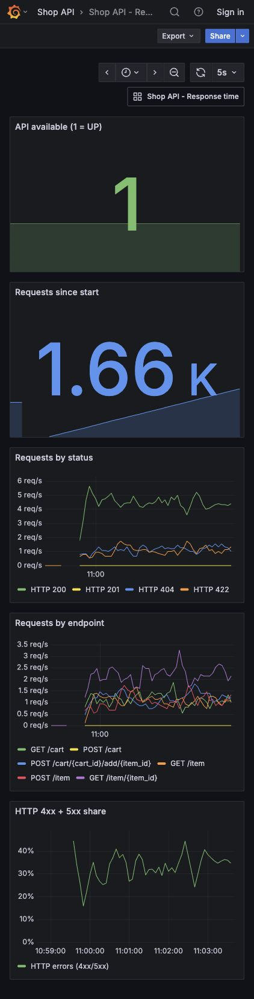
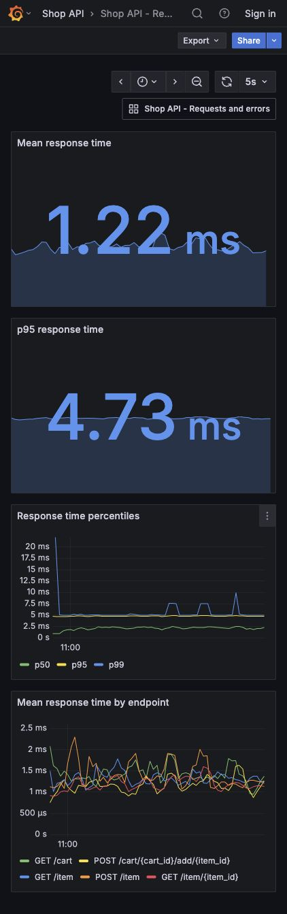

# ДЗ №3: Docker, Prometheus и Grafana

Решение использует готовый Shop API и WebSocket-чат из ДЗ №2.
Ветка `codex/hw3-monitoring` создана от `codex/hw2-submission`.
Требования задания: [lecture3/README.md](../lecture3/README.md).

## Запуск

Требуются Docker Engine с Compose v2 или Docker Desktop.
Команды выполняются из корня репозитория:

```sh
docker compose up --build -d --wait
docker compose ps
```

То же через Makefile: `make up-hw3`.

| Сервис | Адрес |
| --- | --- |
| Shop API, Swagger UI | <http://127.0.0.1:8000/docs> |
| Метрики приложения | <http://127.0.0.1:8000/metrics> |
| Prometheus | <http://127.0.0.1:9090> |
| Grafana: запросы и ошибки | <http://127.0.0.1:3000/d/shop-overview> |
| Grafana: время ответа | <http://127.0.0.1:3000/d/shop-latency> |

Grafana открывается без входа с правами просмотра. Для редактирования можно
войти под `admin` / `admin`; при первом входе Grafana предложит сменить пароль.
Источник данных и оба дашборда создаются автоматически из файлов в
`monitoring/grafana`. Все опубликованные порты привязаны к `127.0.0.1`.

Dockerfile устанавливает только основные зависимости из `uv.lock`, копирует
существующий `shop_api` и запускает один процесс Uvicorn от непривилегированного
пользователя. Один процесс нужен потому, что магазин и комнаты чата хранятся
в памяти. Python работает на версии 3.13; версии uv, Prometheus и Grafana
зафиксированы в Dockerfile и Compose.

## Метрики и дашборды

Prometheus каждые 5 секунд читает `http://shop-api:8000/metrics` во внутренней
сети Compose. Grafana обращается к `http://prometheus:9090`.

`prometheus-fastapi-instrumentator` собирает HTTP-метрики:

| Метрика | Назначение |
| --- | --- |
| `http_requests_total` | Количество запросов по методу, шаблону пути и точному коду ответа |
| `http_request_duration_seconds` | Время ответа по методу и шаблону пути |
| `http_request_duration_highr_seconds` | Гистограмма для общего p50/p95/p99 |
| `http_request_size_bytes`, `http_response_size_bytes` | Размеры запросов и ответов |

Пути с ID группируются по шаблону, например `/item/{item_id}`. Несуществующие
маршруты группируются как `none`. `/metrics`, Swagger и OpenAPI исключены из
подсчёта, поэтому сбор метрик и Docker healthcheck не увеличивают нагрузку на
графиках. WebSocket-чат продолжает работать; эти метрики измеряют HTTP-запросы.

Первый дашборд показывает доступность API (`up`), общее число запросов,
скорость запросов по кодам ответа и маршрутам, долю ответов 4xx/5xx.
Второй показывает среднее время ответа, p50/p95/p99 и среднее по маршрутам.
Квантили оцениваются через `histogram_quantile` по гистограмме с границами
от 0.1 мс, подходящими для быстрого сервиса в памяти. `rate` считает скорость
роста счётчика; среднее время — отношение скоростей `_sum` и `_count`.
Графики требуют как минимум двух сборов метрик и запросов к API.

## Демонстрационный трафик

При установленном Python можно запустить скрипт без дополнительных библиотек:

```sh
python3 hw3/generate_traffic.py --duration 180
```

Или `make demo-hw3`, если используется uv. Скрипт создаёт товар и корзину,
читает данные, добавляет товар в корзину и отправляет запросы с ожидаемыми
ошибками 404 и 422. Частота — примерно 7 запросов в секунду.
Скрипт изменяет данные магазина, поэтому предназначен для локальной демонстрации.
Ошибки 500 в приложении специально не добавлены; их учёт проверяется тестом.

Откройте оба дашборда через 30–60 секунд после начала трафика.
Для повторной демонстрации просто запустите скрипт ещё раз.

## Проверки

```sh
make test
make lint
docker compose config --quiet
docker compose exec prometheus promtool check config /etc/prometheus/prometheus.yml
curl -fsS 'http://127.0.0.1:9090/api/v1/query?query=up%7Bjob%3D%22shop-api%22%7D'
```

Значение `up{job="shop-api"}` должно быть `1`. Дополнительные тесты метрик
проверяют `/metrics`, группировку путей с ID и учёт ответов 200/404/422/500.
Исходные тесты REST API и WebSocket входят в `make test`.

## Скриншоты Grafana

Скриншоты сняты с запущенного стека и реальными запросами к Shop API.





## Остановка

```sh
docker compose down
```

Метрики Prometheus и настройки Grafana сохраняются в именованных томах.
Товары, корзины и комнаты чата сбрасываются при перезапуске приложения,
как и в ДЗ №2.
