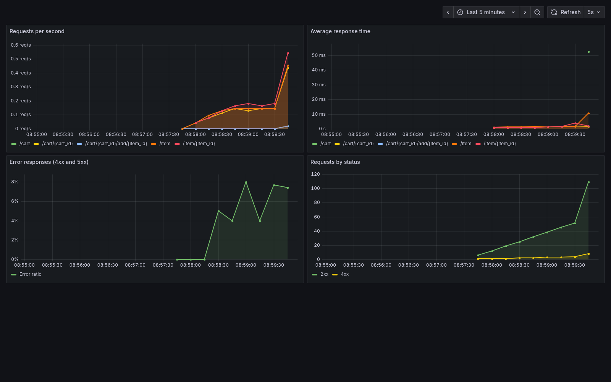
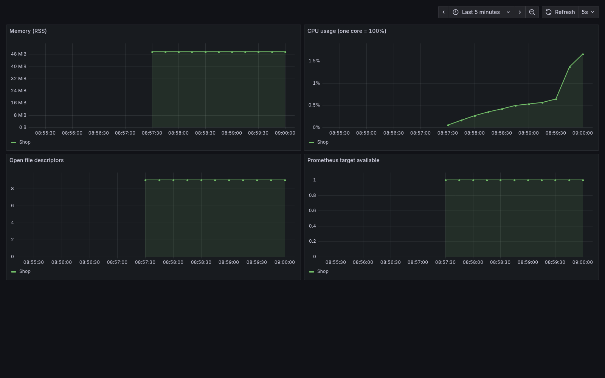

# ДЗ3: Docker и мониторинг

Используется API магазина из второй домашки. Prometheus собирает метрики
с `/metrics` каждые 5 секунд, Grafana показывает их на двух дашбордах.

Запуск из корня репозитория:

```sh
docker compose -f hw3/docker-compose.yml up -d --build
```

- API и Swagger: http://localhost:8000/docs
- Метрики: http://localhost:8000/metrics
- Prometheus: http://localhost:9090
- Grafana, запросы: http://localhost:3000/d/shop-http
- Grafana, процесс: http://localhost:3000/d/shop-process

Источник данных и дашборды настраиваются автоматически. Для просмотра
Grafana вход не нужен. Для редактирования используется стандартный локальный
аккаунт `admin` / `admin` (при первом входе Grafana предложит сменить пароль).
Все порты доступны только с этого компьютера.

Для заполнения графиков можно запустить небольшой скрипт. Он отправляет
запросы только в локальный магазин и не требует дополнительных библиотек:

```sh
python hw3/demo_requests.py
```

На дашбордах показаны запросы в секунду, среднее время ответа, доля ответов
4xx/5xx, число запросов, память и CPU процесса. Первые графики появляются
через 15–30 секунд после начала запросов.

Остановка:

```sh
docker compose -f hw3/docker-compose.yml down
```

Метрики и настройки Grafana сохраняются в Docker volumes. Товары и корзины,
как и во второй домашке, хранятся в памяти и теряются при перезапуске API.

## Скриншоты

Запросы к API:



Состояние процесса:


